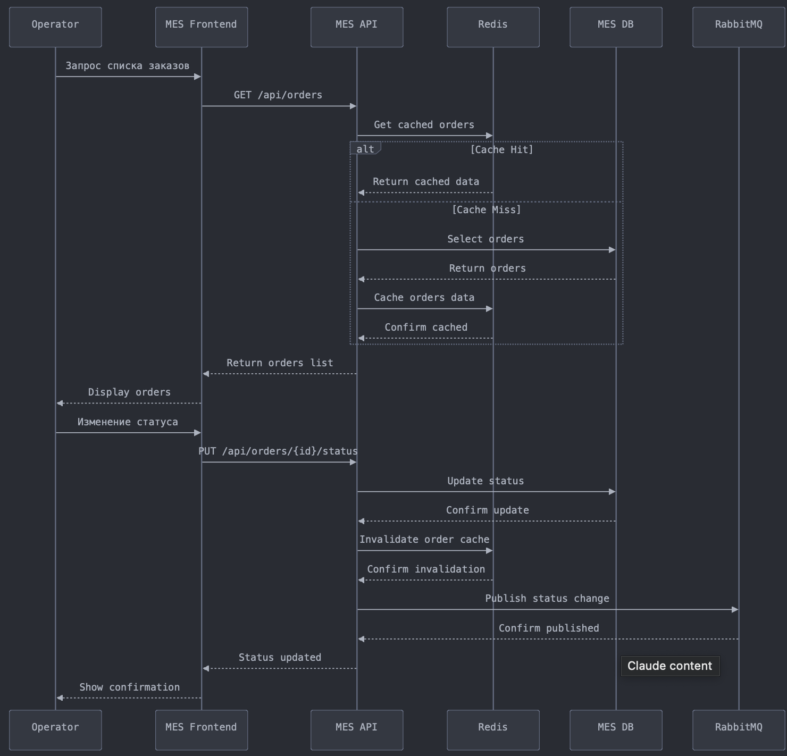

# Архитектурное решение по кешированию

## Мотивация

### Текущие проблемы
1. **Производительность MES:**
   - Медленная загрузка страницы со списком заказов
   - Высокая нагрузка на базу данных при отображении дашборда
   - Задержки при расчете стоимости заказов

2. **Влияние на бизнес:**
   - Неэффективная работа операторов
   - Потеря клиентов из-за медленной обработки заказов
   - Риск потери B2B контрактов

### Элементы для кеширования

1. **Критичные данные:**
   - Список активных заказов
   - Результаты расчета стоимости
   - Статусы заказов

2. **Статические данные:**
   - Справочники материалов
   - Базовые цены
   - Конфигурации производства

## Предлагаемое решение

### Типы кеширования

1. **Клиентское кеширование:**
   - Service Worker для веб-приложения MES
   - Browser Cache для статических ресурсов
   - Local Storage для пользовательских настроек

2. **Серверное кеширование:**
   - Redis как распределенное хранилище
   - In-memory кеширование для часто запрашиваемых данных
   - Кеширование результатов расчета стоимости

### Выбор паттерна кеширования

#### Cache-Aside (Выбранный паттерн)
**Преимущества:**
- Гибкость в управлении данными
- Устойчивость к сбоям кеша
- Простота реализации
- Контроль над устареванием данных

**Применение:**
- Чтение списка заказов
- Получение статусов
- Доступ к справочникам

#### Почему не Write-Through
- Избыточная синхронизация для редко изменяемых данных
- Повышенная латентность при записи
- Сложность при частичном обновлении данных

#### Почему не Refresh-Ahead
- Сложность предсказания нужных данных
- Риск кеширования неиспользуемых данных
- Дополнительная нагрузка на систему

### Стратегия инвалидации кеша

#### Сравнительный анализ стратегий

| Критерий | Временная (TTL) | По ключу | Программная |
|----------|----------------|-----------|-------------|
| Актуальность данных | Средняя | Высокая | Высокая |
| Сложность реализации | Низкая | Средняя | Высокая |
| Нагрузка на систему | Низкая | Средняя | Высокая |
| Гибкость | Низкая | Высокая | Высокая |
| Контроль | Низкий | Высокий | Высокий |

#### Выбранное решение: Комбинированный подход

1. **По ключу + TTL:**
   - Инвалидация по ключу при изменении статуса заказа
   - TTL как защитный механизм от устаревших данных
   - Разные TTL для разных типов данных:
     * Активные заказы: 5 минут
     * Справочники: 1 час
     * Расчеты стоимости: 30 минут

2. **Программная инвалидация:**
   - При критических изменениях в системе
   - При обновлении справочников
   - При изменении алгоритмов расчета
